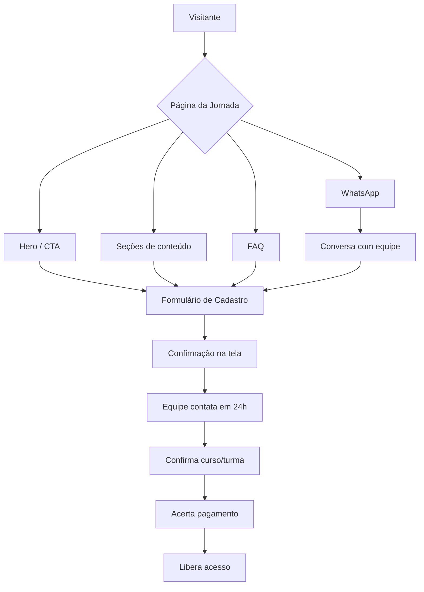

# Exemplo de Especificação de Site — Jornada de IA

> **Contexto:** Especificação completa de site para trilha educacional com 3 cursos (escadinha), venda direta via cadastro.
> **Projeto real:** Jornada de IA da ID Consultoria (julho/2026).
> **Uso:** Use como template/referência ao criar especificações de site para produtos educacionais.

## Estrutura do Documento

O documento original (`/opt/data/jornada-ia-id/site/especificacao-site.md`, 621 linhas) cobre:

| Seção | Conteúdo |
|---|---|
| Visão Geral | Propósito, tom de voz, resumo executivo do produto (preços, formato, diferenciais) |
| Navegação | Menu fixo com âncoras, dropdown, CTA sticky mobile |
| Hero | Headline, subheadline, badges de diferenciais, CTA primário |
| A Escadinha | Visão geral da progressão entre cursos com diagrama conceitual |
| Público-Alvo | Duas colunas: para quem é / não é |
| Metodologia | Cards de diferenciais + tabela comparativa com concorrentes |
| Os 3 Cursos | Descrição completa de cada curso (sem ementa): headline, descrição, público, o que aluno faz ao final, pré-requisitos, projeto prático |
| Preços e Cronograma | Tabela de preços com parcelamento, tabela de turmas, âncora de valor |
| Sobre o Instrutor | Bio, diferenciais, metodologia proprietária |
| Prova Social | Cards de indicadores (NPS, turmas, comunidade) + placeholder depoimentos |
| FAQ | 12 perguntas em accordion |
| Cadastro | Formulário funcional com 8 campos + fluxo de venda direta |
| User Flow | Fluxo principal e alternativo |

## Pattern: Venda Direta via Cadastro

Em vez do fluxo automatizado (página → checkout → pagamento → acesso), o modelo de **venda direta** funciona assim:

```
Visitante → Página → Formulário de cadastro → Equipe contata em 24h → Acerta pagamento → Libera acesso
```

### Campos essenciais do formulário

| Campo | Tipo | Obrigatório |
|---|---|---|
| Nome completo | Texto | ✅ |
| Email | Email | ✅ |
| Telefone / WhatsApp | Tel com máscara (DD) 9XXXX-XXXX | ✅ |
| Empresa (opcional) | Texto | ❌ |
| Curso de interesse | Radio (C1 / C2 / C3 / Pacote) | ✅ |
| Forma de pagamento desejada | Radio (Cartão / Pix / Boleto / CNPJ) | ✅ |
| Como conheceu | Dropdown (Instagram, LinkedIn, WhatsApp/IAF, Indicação, Google, Outro) | ❌ |
| Mensagem | Textarea | ❌ |

### Considerações do modelo

- **Vantagens:** Contato humano aumenta conversão em tickets altos, permite negociar pacotes B2B, reduz abandono de checkout
- **Desvantagens:** Não escala tão rápido quanto checkout automatizado, precisa de equipe de vendas
- **LGPD:** Incluir aviso de consentimento abaixo do formulário
- **Confirmação:** Mensagem na tela + email automático de recebimento

## Pattern: Separação Ementa vs. Site

Quando a ementa (conteúdo programático detalhado) ainda não está pronta mas o site precisa andar:

1. Especifique TODAS as seções do site sem a ementa
2. Deixe um placeholder claro: "⏳ Seção em construção — ementa será especificada em etapa posterior"
3. Documente onde a ementa deve ser inserida (posição na hierarquia, formato esperado)
4. Inclua nota para o designer/dev: "deixar espaço reservado entre seção X e seção Y"

## User Flow Template



## Checklist de Conteúdo para Especificação de Site

- [ ] Propósito e tom de voz definidos
- [ ] Resumo executivo do produto (preços, formato, diferenciais)
- [ ] Estrutura de navegação (menu, âncoras, CTA sticky)
- [ ] Hero (headline, subheadline, badges, CTA primário)
- [ ] Seções de conteúdo completas (texto especificado campo a campo)
- [ ] Preços e cronograma (com parcelamento)
- [ ] Formulário de cadastro (campos, validações, fluxo pós-envio)
- [ ] FAQ (perguntas reais de alunos)
- [ ] Prova social (NPS, depoimentos, indicadores)
- [ ] User flow diagramado
- [ ] Observações técnicas para designer/dev (SEO, analytics, variações de estado)
- [ ] Tabela de conteúdo pronto vs. pendente
- [ ] Placeholder para ementa (se não estiver pronta)
